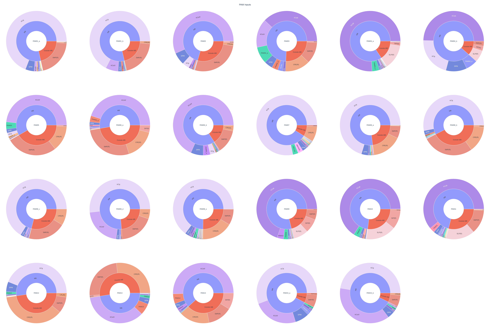

# DAN-Connectivity

Connectivity overview of the *Drosophila* PAM-DAN network using the [Hemibrain connectome](https://www.janelia.org/project-team/flyem/hemibrain).

## Overview

Fetch all synaptic inputs and outputs for PAM dopaminergic neurons from the hemibrain connectome and visualize the connectivity as sunburst plots. Neurons are categorized by whether connections occur within the Mushroom Body (MB) lobes or outside the MB.

## PAM Inputs

The figure below shows the synaptic inputs onto each PAM neuron type. Each sunburst panel is centered on a single PAM type. The inner ring separates MB from Outside-MB connections; the outer ring breaks down inputs by presynaptic neuron type (within MB) or brain region (outside MB). Only connections with > 5 synapses are shown.

